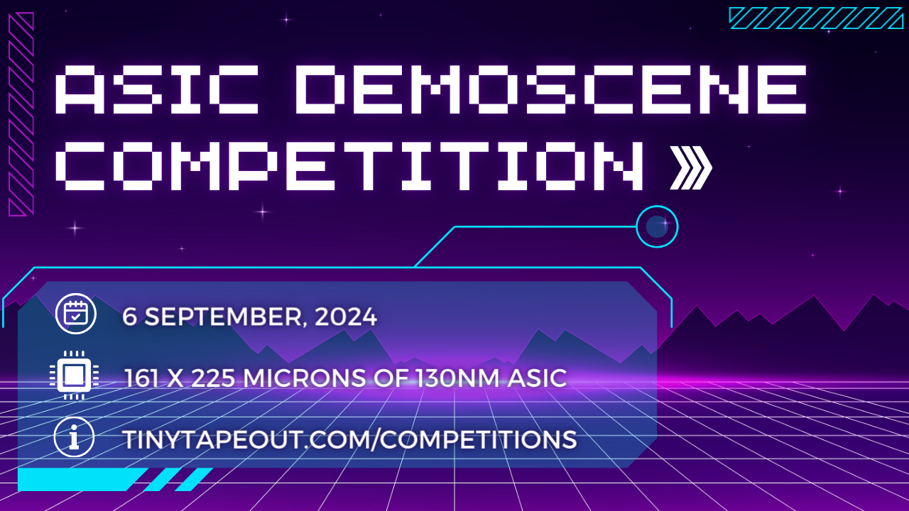

## Demo scene competition!

The [home computer demo scene](https://en.wikipedia.org/wiki/Demoscene) has resulted in some amazing feats of hacking and pushing hardware to its limits.

The Tiny Tapeout demo scene sticks to the same video / sound output format, but you create your own ASIC hardware!

All entrants will get a free [VGA](https://github.com/mole99/tiny-vga) and [Audio](https://github.com/MichaelBell/tt-audio-pmod) PMOD expansion module!

## What are the rules?

* 2 tiles or less.
* VGA pinout following [Leo's VGA PMOD pinout](https://github.com/mole99/tiny-vga)
    * your VGA timing should follow something from [http://www.tinyvga.com/vga-timing](http://www.tinyvga.com/vga-timing) or [https://tomverbeure.github.io/video_timings_calculator](https://tomverbeure.github.io/video_timings_calculator) 
    * The following projects have all been tested and work with one judge’s panel:
        * [Flappy VGA](https://tinytapeout.com/runs/tt05/134)
        * [VGA experiments](https://tinytapeout.com/runs/tt05/334)
        * [VGA dino game](https://tinytapeout.com/runs/tt05/458)
        * [VGA SPI ROM](https://tinytapeout.com/runs/tt05/645)
        * [One sprite pony](https://tinytapeout.com/runs/tt05/326/)
* Audio pinout following [Mike's audio PMOD pinout](https://github.com/MichaelBell/tt-audio-pmod). 
    * Mike has an [example project here](https://github.com/MichaelBell/tt08-pwm-example) that creates a sine wave on the audio output pin.
* No other hardware required.
* Start up sequence using the commander app:
    * Enable the project,
    * Judges will read the datasheet to understand how to set the inputs and clock,
    * Reset.
* Must be submitted to TT08.

## Categories

* Newcomer - TT08 must be your first tapeout on Tiny Tapeout,
* Best sound track,
* Best single tile design,
* Best graphics,
* Rulebreaker - example using more than 2 tiles, using RP2040 for something. be aware that judges must be able to test your design with no additional hardware,
* Mixed signal - uses some analog in the design,
* Most useful design,
* Best design submitted 1 week before the deadline!

## How to enter

* Submit your design's URL to the [competition form](https://forms.gle/WtNjEgWybs3vCQPF9) before the closing date of 6th the September.

## How to get help

* Discuss on the [competition channel](https://discord.com/channels/1009193568256135208/1259420274445516891) discord community channel. Join the [discord here](/discord).
* [Quick start VGA graphics at the VGA playground](https://tinytapeout.github.io/vga-playground/).
* [Audio output demo](https://github.com/MichaelBell/tt08-pwm-example).

## Prizes

* All entrants will get a [VGA](https://github.com/mole99/tiny-vga) and [audio PMODs](https://github.com/MichaelBell/tt-audio-pmod) and a sticker pack.
* Winners of each category will receive combinations of:
    * Matt’s first ASIC die mounted in an epoxy cube, numbered and signed,
    * ASIC baseball caps,
    * Free tiles for future tapeouts,
    * Previous TT chips.

## Small print

1. How will the competition be judged? A panel of appointed judges will vote and have the final say. The submissions will be judged on the results the judge gets on their boards.
2. Will there be any extension to the deadline? No, it’s September 6th.
3. You can change the documentation used by the judges up to the point of judging the design. Any changes must be submitted to the chip datasheet by pull request to the GitHub repository.
4. When will the competition be judged? 2 weeks after 75% of the boards have been received by entrants (estimated June 2025).
5. Your design must not depend on any other hardware.
6. You are not limited to a maximum clock frequency, but if the judges can’t get the design to work (because their ASIC is slower for example) then you run the risk of not qualifying. You are advised to use ~80MHz or less.
7. You are advised to stick with a standard VGA timing, if it doesn’t work on the judge’s display you run the risk of not qualifying.
