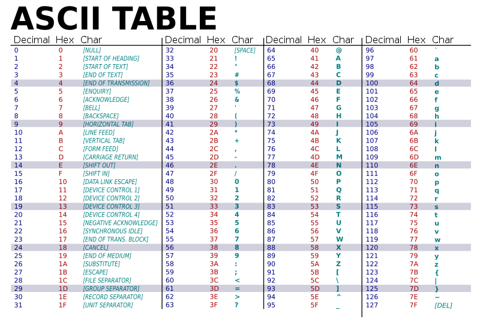

This design implements a UART transmitter using registers made from D-flip flops and multiplexers.

**Background**

UART stands for *Universal Asynchronous Receiver Transmitter* and is a common serial protocol useful for getting data to/from a device, for example between an Arduino and a computer or a sensor.

UART works by sending data frames serially (i.e. one bit after another) at a pre-specified data rate, also known as a baud rate. While several different data frames are possible, commonly the 8N1 protocol is used to send *8* bits with *N*o parity bit, and *1* stop bit. We can observe this protocol in the image below. A few things to note:
* The wire is held at Logic 1 during idle periods between data frames
* Each data frame begins with a Start Bit where the wire transitions goes to Logic 0 for one bit period
* 8 bits of data are then transmitted (often least-significant bit first, but not always!)
* The data bits are then followed by a Stop Bit where the wire goes to Logic 1 for one bit period
* While 8N1 only sends 8 bits at a time, multiple data frames can be transmitted sequentially 

The duration of a bit is determined by the bit rate of the UART transmitter and receiver, and the data rate must be set to the same value in both the transmitter and receiver for successful communication.

### Example 1: Single Character Transmission

This circuit, inspired by @maehw, implements a shift register with 17 bits: four idle bits, one start bit, eight data bits, one stop bit, and three more idle bits.


 

The circuit supports transmitting a user-selected ASCII character from 0x40 (@) to 0x5F (_), including capital letters from the Latin alphabet. 

**How to use**

Example Sending 'A'
1. Set the Arduino serial baud rate `Serial.begin(<baud rate>);` in the *.ino file to 300
2. Set the Wokwi clock frequency `"attrs": { "frequency": "300" }` in the diagram.json to 300 as well
3. Set SW7 to OFF ("Load")
4. Set SW2 to ON and SW3-6 to OFF
5. Set SW7 to ON ("TX")
6. Set SW8 to ON ("Output Enable"). If there's no output from the Wokwi Arduino serial monitor, try toggling SW7 OFF and ON again.

Congratulations! You should now see the letter being output in the Wokwi Arduino Serial monitor at the bottom of the simulation.

Note that garbage characters may be printed upon initialization.

| SW      | Function| 
|---------|---------|
| 1       | N/A     | 
| 2       | Bit 0   | 
| 3       | Bit 1   |
| 4       | Bit 2   | 
| 5       | Bit 3   | 
| 6       | Bit 4   |
| 7       | Load/TX | 
| 8       | Output Enable | 

### Example 2: Multiple Character Transmission

This circuit implements five shift registers to transmit 'Tiny\n'.


 

Each column of flip flops stores a single ASCII character. To modify a character, change bits 6-0 by modifying whether the respective multiplex is set to VCC or GND. 

To add characters, copy and paste a column. Connect the output of the new column (Q port of the upper-most D-flip flop) to the input of the stage to the left (bottom-left most multiplexer port). Remember to connect the multiplexer select signal and the clock to the new column as well.

Lastly, delete the the output of the first column (Q port of the upper-most D-flip flop) and create a new connection to the to the input of the new stage you've added (bottom-left most multiplexer port).

**How to use**

To begin transmission:
1. Set the Arduino serial baud rate `Serial.begin(<baud rate>);` in the *.ino file to 300
2. Set the Wokwi clock frequency `"attrs": { "frequency": "300" }` in the diagram.json to 300 as well 
3. Set the slide switch to the clock
4. Set SW7 to OFF ("Load")
5. Set SW8 to ON ("Output Enable")
6. Set SW7 to ON ("TX"). If there's no output from the Wokwi Arduino serial monitor, try toggling SW7 OFF and ON again.

Congratulations! You should now see your customized letters being output in the Wokwi Arduino Serial monitor at the bottom of the simulation.

Note that garbage characters may be printed upon initialization.

| SW      | Function| 
|---------|---------|
| 1       | N/A     | 
| 2       | N/A     |
| 3       | N/A     |
| 4       | N/A     | 
| 5       | N/A     | 
| 6       | N/A     |
| 7       | Load/TX | 
| 8       | Output Enable | 

{}
