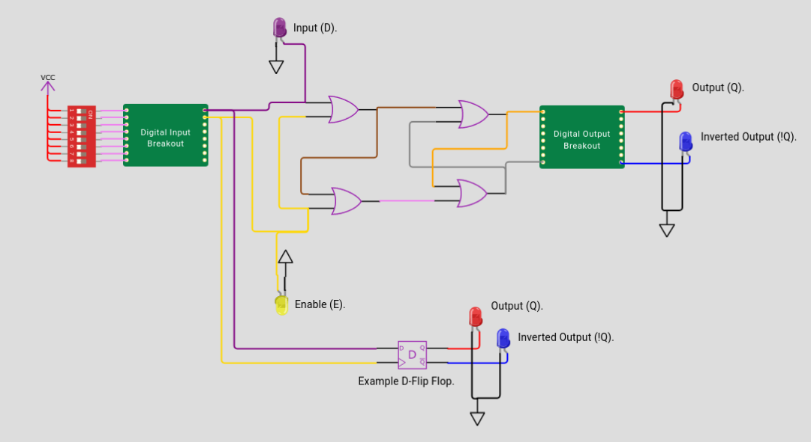

In this puzzle, you will figure out how to build a flip flop from basic logic gates.

What is a flip flop? A [flip flop](https://en.wikipedia.org/wiki/Flip-flop_(electronics)) is a circuit that can stably store one bit of information. In other words, its output will hold a 1 or 0 until both the *input* changes and *enable* goes to 1. 

Why are flip flops important? Flip flops play an important role in synchronizing signals and storing information. For synchronization, flip flops allow a circuit to control precisely when an input signal passes through to the rest of a circuit. This control is managed via an enable signal--for example if the enable signal is 1, the output will equal the input, however if the enable signal is 0, the output will not change regardless of the input.

Similarly once the enable signal is activated, a flip flop is able to store information, meaning that even if the input changes, the output will hold its value until the enable signal is activated again. With the ability to store information, it becomes easier to develop modular, programmable circuits to measure, compute, and transmit information. A flip flop is thus a key building block in digital design, and one that is important to understand if, for example, you want to learn a [hardware description language  (HDL)](https://www.zerotoasiccourse.com/terminology/hdl/). 

For the puzzle, a basic flip flop has been created. However, someone has changed all the gates to OR gates and now the outputs are wrong! Using your [knowledge of logic gates and truth tables](/digital_design/logic_gates), **can you figure out which gate to use to fix the flip flop?**

.

Feel free to play around to try to figure it out. You can always return to the [logic gate tutorial](/digital_design/logic_gates) if you need a refresher. 

You can also check out the [**solution**](https://wokwi.com/projects/344329074509873746).

This is by no means an exhaustive explanation of flip flops. There are many more important details that ASIC designers often encounter when using flip flops, like [static timing analysis](https://www.zerotoasiccourse.com/terminology/sta/), check out this video: 


