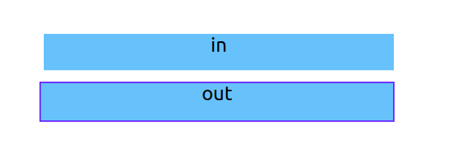
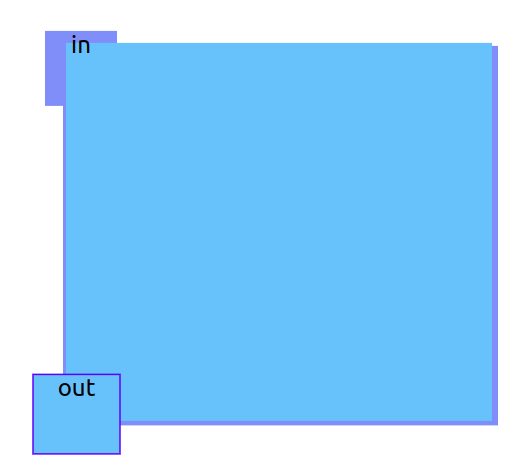
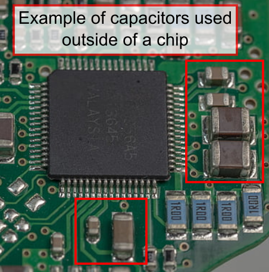
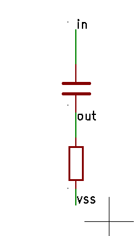
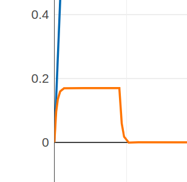

### Aim

*   Understand that capacitance changes with area and distance
*   Investigate capacitance between objects on the same layer
*   Creating capacitors using the **mimcap** layer
*   Learn how to get the most capacitance
*   Check your design using the DRC

We’ve already seen an example of parasitic capacitance - now let’s intentionally draw a capacitor and see how big of a value we can create.

As mentioned, a capacitor is formed whenever we have 2 conductive shapes separated by a non conductive space. Let’s try drawing a capacitor with the **metal2** layer.

Use the SPICE checkbox to see the capacitance. You’re looking for a line that looks like **C0 out in** and then some numbers. I got 0.73fF. The F stands for Farads, the unit of capacitance. The f stands for femto, there are 1,000,000,000,000,000 femto Farads in one Farad! So this is a very tiny capacitor!

Have a go at making a bigger value of capacitor. With resistors, a long thin wiggly shape makes a big resistance. With a capacitor, we want the most area. The biggest I managed using only **metal2** was 14fF.

### Using more than 1 layer

Now let’s try using 2 layers, **metal1** and **metal2**. Do you think we’ll be able to make a bigger capacitor?

I thought my capacitor would be bigger, but I only managed 0.22fF. The reason this capacitor isn’t as big as the one on **metal2** is that the distance between **metal1** and **metal2** is large compared to the gap we can create on one layer. This can be seen if you look at the equation for the capacitance of two parallel plates:

Where C is the capacitance, ε is the dielectric constant, A is the overlapping area between your layers, and d is the distance between the layers. When the distance d between layers increases, the capacitance decreases.

Chips don’t have a lot of area, so making big capacitors on a chip is hard. That’s why we often need to use capacitors outside of the chip if we want really big ones.

However, we do have a way to make better capacitors, and that’s using the **mimcap** layer. mim stands for “metal insulator metal,” and it’s a special metal layer that’s much closer to **metal1** than **metal2** is.

Because we can only put labels on **metal1** and **metal2** layers, we also need a **metal2 via** to connect the **metal2** layer to the **mimcap** layer.

### Run DRC

Draw a square of **metal1** and on top of that a square of **mimcap**. Take a look at the DRC report (below the cross section):

DRC stands for [Design Rule Check](https://www.zerotoasiccourse.com/terminology/drc/). We can’t just draw whatever we want and have it made into a chip. A big part of the PDK includes DRC rules that make sure we only send designs to the factory that they can actually make.

If you click on the error it will highlight the problem on the canvas. Select **metal1** again and draw a bigger square so it extends a little on all sides of the **mimcap** layer. The error should disappear when it’s resolved.

### Maximum capacitance

Now that we have a capacitor between the **mimcap** and **metal1** layers, let’s connect up the input and output ports. For the **out**, you can just add a label to the **metal1** layer. To connect a port to the **mimcap** layer, you’ll need to first use **metal2 via** and then **metal2** above that. Once you’ve drawn the **metal2** square, label it as **in**.

Using the SPICE checkbox, find out your new capacitance. I managed 970fF with the one above, so nearly 5000 times bigger than the one between **metal1** and **metal2**.

What happens to the output curve when you make the input rise faster by decreasing the rise time?

Now the capacitor is so much bigger than the parasitic one we made when experimenting with the resistor in lesson 1, the output falls much slower. So slow we can’t really see it unless you zoom into the graph a lot.

### Pull down

By connecting a **pull down** resistor between the capacitor and vss we can drain it faster.

If you don’t remember how we made a resistor in lesson 1, go back and take a look. Then follow these steps and see if you can draw it yourself.

1.  Draw a square of **metal1 via** so it connects to the **metal1** output square
2.  Draw a long skinny resistor using **polyres** - maybe make it about 0.5μm thick and 20μm long.
3.  Use another **metal1 via** at the end of the resistor
4.  Draw a square of **metal1** above the **metal1 via**
5.  Label the **metal1** square **vss**.

You should now see the output voltage doing something different. If we zoom in a bit we can see it more clearly.

If you get stuck, [here’s my solution](https://app.siliwiz.com/?preset=mimcap).

Experiment with the input rise time, what happens to the output pulse?

A common use for a combination of a resistor and a capacitor is making a filter. We can filter out some frequencies of inputs and leave others.

As it takes a specific amount of time to charge up and discharge, this circuit can also be used to build a timer.
