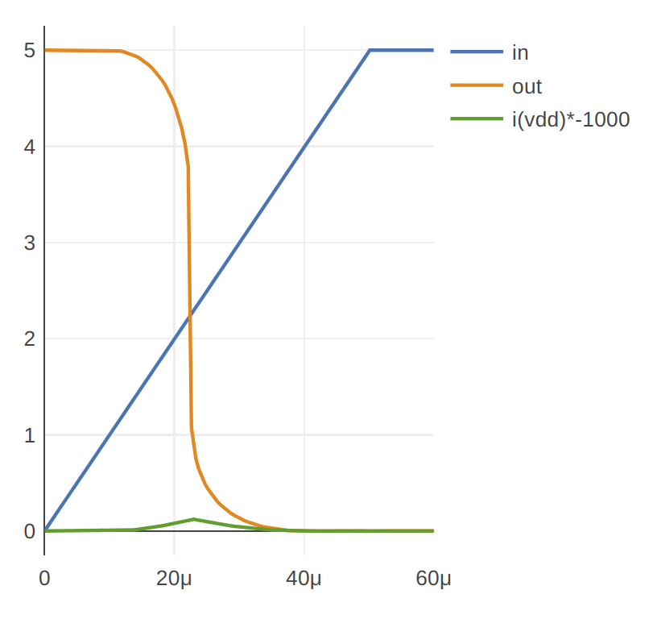
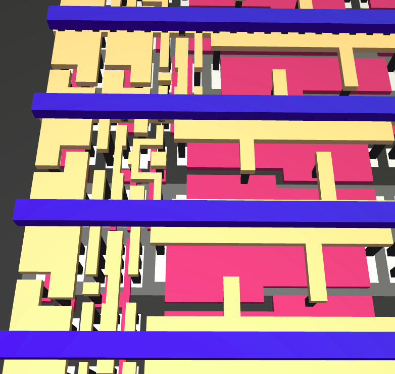
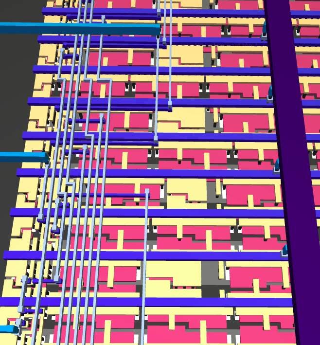

### Aim

*   Understand the benefit of CMOS
*   Learn what a standard cell is
*   Compare your design to the Sky130 standard cell
*   Next steps

As we’ve seen, an NMOS inverter is inefficient because it’s wasting energy through the resistor. CMOS logic replaces the pull up resistor with a P type mosfet. As the P type is the complementary version of the N type, we call this type of logic Complementary Metal Oxide Semiconductor or CMOS for short.

There are many ways to draw this, but it’s fairly usual to use the same piece of polysilicon as the gate for both the P type and N type. If you get stuck you can check [my solution here](https://app.siliwiz.com/?preset=inverter).

And the simulation shows the CMOS inverter is working nicely:

I also added the current in the simulation traces. You can see we get a little spike as the inverter operates, but in either high or low states, the current is very low. This efficiency is the reason why CMOS is still the most commonly used type of logic gates used in computer chips.

### Standard cells

We’ve seen how to draw and make a logic inverter, but there are many other types of logic gates like AND, OR and NOT gates. Feel free to try drawing some yourself! Share your designs with us in the [Discord community channel](https://discord.gg/e3FK68Z98y). Use the hashtag [#SilliWiz](https://twitter.com/search?q=siliwiz&src=typed_query) on social media.

A typical PDK will include hundreds of standard cells. Here’s the Skywater 130nm inverter standard cell:

Can you identify the P and N type MOSFETs? Can you see the input and output ports? [Here’s a 3D view](https://gds-viewer.tinytapeout.com/?model=https://tinytapeout.github.io/sky130B-cells-gltf/cells/sky130_fd_sc_hd__inv_1.gds.gltf) of the same cell:

One thing that makes standard cells standard is that they all have the same height and the top and bottom always includes the power supply vdd and vss. This lets us put lots of cells all together on a grid.

Here’s a 3D view of some standard cells all together, powered by the blue vss and vdd lines.

Can you spot an inverter?

And here we see how the wires connect up the cells into a more complex digital machine:

If you want to explore this design yourself:

*   [here’s the 3D viewer](https://gds-viewer.tinytapeout.com/?model=https://tinytapeout.github.io/tt02-test-invert/tinytapeout.gds.gltf)
*   [the logic design](https://wokwi.com/projects/341535056611770964)
*   [more information about the design](https://tinytapeout.com/runs/tt02/000/)

### What next?

[Leave feedback!](https://forms.gle/fY5phQRc2dnzBRmf9) Please let us know your thoughts and ideas for improvements. You can also use this form to request more information about SiliWiz and TinyTapeout for schools and universities.

*   Share a picture of your design on social media with the [#SiliWiz hashtag](https://twitter.com/search?q=siliwiz&src=typed_query)
*   [Learn how to use logic gates to build simple circuits and get them manufactured!](http://tinytapeout.com)
*   [Take Matt’s highly rated and more advanced Zero to ASIC course](https://zerotoasiccourse.com)
*   Try drawing stick diagrams with [Stixu](https://stixu.io/)
*   [Watch videos on the Zero to ASIC course youtube channel](https://youtube.com/zerotoasic)
*   [Sign up to the mailing list](https://zerotoasiccourse.com/newsletter)
*   [Join the community discord](https://discord.gg/e3FK68Z98y) and let us know what you think about SiliWiz!
*   [Contribute to SiliWiz](https://github.com/wokwi/siliwiz/issues)

Thanks and credits
------------------

SiliWiz is a project by [Matt Venn](https://mattvenn.net/). Thanks to all the testers and in particular to:

*   Tim Edwards & Holger Vogt for help with creating SiliWiz,
*   Eric Smith and Thomas Parry for lesson ideas and review.
