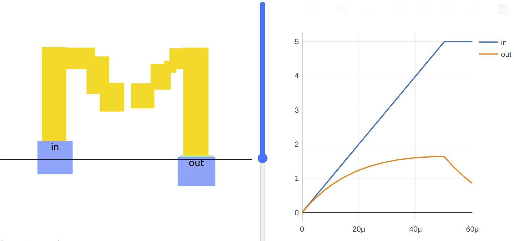
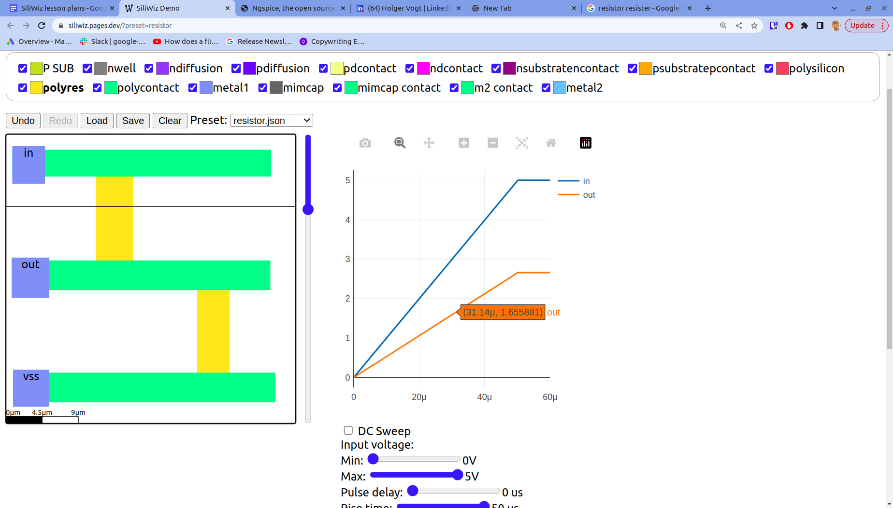

#2 Parasitics
-------------

### Aim

*   Understand what parasitic means in microelectronics
*   See how we get unwanted capacitance and resistance in our circuits

What do you think will happen to the orange output line when you delete a part of your initial? Make a prediction. To delete a part, select it then either choose ‘delete’ or press the D key.

What happens? Did you expect it? You probably got something like me:

The blue input line keeps doing what it was doing, but the orange output has a nice curve now. What’s happening is that even though there is no direct circuit for the electricity to flow through your letter, we have made a small capacitor by having 2 conductive elements separated with a small non conductive gap. A capacitor is a circuit element with 2 ports. The electric field between the 2 elements works to keep the voltage across the plate the same. The capacitor charges up as the input rises, but then it slowly decays back to 0 once the input stops changing.

What happens to the output curve when you make the input rise faster by decreasing the rise time?

### Parasitic Capacitance

This type of effect is called parasitic capacitance. We didn’t really want or expect it, but it’s there because that’s how the world works. Parasitics are often unnoticeable at a larger scale, but the capacitor you just made is only 1μm wide and has a noticeable effect on the output of your circuit. Analyzing parasitics is an important part of microelectronics and can’t be ignored if we want our chips to work properly.

### Parasitic Resistance

Why did the capacitor discharge to zero? Because it also has a parasitic resistance that allows the electricity to leak out!

#3 Divide a number with 2 resistors
-----------------------------------

### Aim

*   Make something useful
*   Demonstrate some limitations of circuit extraction
*   Make some measurements on the plot

In the previous lesson you learnt the basics of SiliWiz. Now we’re going to put that knowledge to use and build a tiny calculating machine on a silicon chip. We’re going to build a potential divider. This takes a voltage in, divides it, and gives us the answer.

How many connections does this device have? We need one for in and out as before, and we’re going to add a new one called vss. vss is also called ground or 0v. It’s used as a reference for the rest of the circuit.

Let’s try to make a potential divider that divides by 2. So if 4v goes in, then 2v should come out. That’s actually easy, all we need is to make the 2 resistors the same resistance.

If the input voltage looks like this:

What do you think the output voltage should look like? Make a prediction and see if you’re right after you’ve drawn the divider.

There are lots of ways to draw it, but you’ll at least need:

*   3 metal1 squares, labelled in, out and vss
*   3 metal1 vias to connect between metal1 and polyres
*   2 resistors made out of polyres that are joined between the 3 contacts.

### How does it work? Magic!

Another important tool behind the SiliWiz scenes is called [Magic](https://www.google.com/url?q=https://www.zerotoasiccourse.com/terminology/magic/&sa=D&source=editors&ust=1677096507821195&usg=AOvVaw2enChYQeADwuyOhafb-sEd). It’s a powerful tool but it’s not very beginner friendly, which is one reason we wanted to make SiliWiz. Magic has been used for 40 years to help design chips! We are using it for [DRC](https://www.google.com/url?q=https://www.zerotoasiccourse.com/terminology/drc/&sa=D&source=editors&ust=1677096507821692&usg=AOvVaw0aA9TDFasJNNG4Wz0Dy4zR) and [circuit extraction](https://www.google.com/url?q=https://www.zerotoasiccourse.com/terminology/pex/&sa=D&source=editors&ust=1677096507822110&usg=AOvVaw2359xPCklGeIqFWxRDRmgD).

As mentioned earlier, we have two layers that actually specify the same material, polysilicon and polyres. There is no difference between the two layers when the chip is manufactured. The reason we keep them separate is to make Magic’s job easier when it extracts the circuit from the picture we draw.

A limitation you might run into when drawing the divider is that Magic can't tell this is two separate resistors. It extracts just a single resistor between the first 2 contacts.

You have to draw 2 separate rectangles, one for each resistor:

Once your divider is finished, you should see a simulation like this:

Play with the simulation controls to change the input signal’s min, max and rise time.

*   How close is your divider to dividing the input voltage by 2?  Can you measure how accurate it is?
*   How could you make the divider more precise?
*   What's best, big or small shapes?
*   Can you make a divide-by-3 potential divider?

### Solution

If you get stuck, take a [look at my solution](https://www.google.com/url?q=https://siliwiz.pages.dev/?preset%3Dresistor&sa=D&source=editors&ust=1677096507825565&usg=AOvVaw2f0BOC4vfYVdL1BUm5ff-2).
