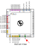

The information in this document applies to Tiny Tapeout 4 and beyond.

Tiny Tapeout includes a clock input signal (`clk`), provided externally through the `mprj_io[6]` pin of the caravel chip (pin number 37 in the QFN-64 chip package).



## Limitations

Internally, both the `clk` and `rst_n` pins are handled like any other input pins. We expect a latency (insertion delay) of up to 10 nanoseconds between the chip's I/O pad and your project's clock.

The caravel chip uses the [sky130_ef_io_gpiov2_pad](https://skywater-pdk.readthedocs.io/en/main/contents/libraries/sky130_fd_io/docs/user_guide.html#sky130-fd-io-gpiov2-additional-features) macro for the I/O pads. The documentation specifies a maximum input frequency of 66 MHz. Therefore, we believe that the maximum clock frequency for your designs will be around 66 MHz.

## Clock Generation

The Tiny Tapeout Demo board can generate the clock signal for your design. The frequency of the clock signal can be configured by the user, between 3 Hz and 66.5 MHz. The clock is generated by the on-board RP2040 microcontroller, using the PWM hardware peripheral to divide the RP2040 system clock.

The Demo board runs MicroPython, and the clock generation is controlled by a simple Python script. You can find the source code for the clock generation in the [Tiny Tapeout Commander App repository](https://github.com/TinyTapeout/tt-commander-app/blob/main/src/ttcontrol/ttcontrol.py) (look for the `set_clock_hz` function). 

If you have a Pi Pico (or any other RP2040-based board), you can install MicroPython on it and use [the Commander App](https://commander.tinytapeout.com) to experiment with the clock generation.

### Low Frequency Clock

In case you need a very slow clock like 1Hz, you can generate it with a simple MicroPython program like this:

```python
import machine
import time

GPIO_PROJECT_CLK = 0
clk_pin = Pin(GPIO_PROJECT_CLK, Pin.OUT)
while True:
    clk_pin.value(1)
    time.sleep(0.5)
    clk_pin.value(0)
    time.sleep(0.5)
```

### Waveform Example


